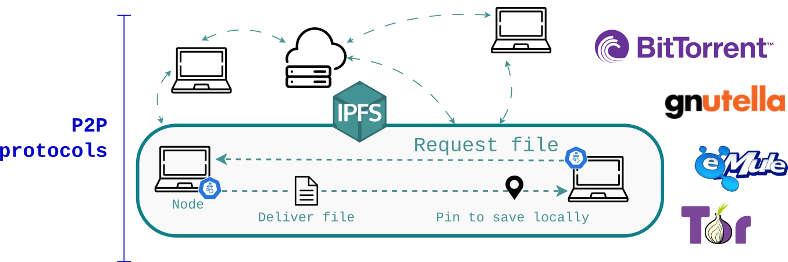

# Decentralized Domains

A new front-end client at [http://libgen.crypto](http://libgen.crypto) is available. If you have trouble accessing `.crypto`, you can use gateways, but be aware they are vulnerable to takedowns:

|Gateway|
|-------|
|[https://libgen-crypto.ipns.dweb.link/](https://libgen-crypto.ipns.dweb.link/) |
| [https://dweb.link/ipns/libgen.crypto](https://dweb.link/ipns/libgen.crypto) |


Multiple domain names has been par the course for LibGen. To understand the big deal behind it, [read about Web 2.0, its shortcomings, and Web 3.0](#web-20).

Presently, support for a decentralized Web (dWeb) is not universal. Full dWeb is secure and authority independent, but rather cumbersome to setup. For this reason, intermediary gateways exist.

## Access the dWeb today

These programs enable access to blockchain-pegged sites. In some regions, they only work via VPN connection. You can use [Opera] browser with its built-in VPN, or [Brave] with its built-in TOR layer.

|TLD| Acess through... | DNS|
|-------|---|------|
| `libgen.crypto`, `.zil` | [Brave], [Opera], [Kiwi], [xUD] |Unstoppable Domains |
|`ipfs://libgen.crypto`| [Brave], [xIPFS] | IPFS |
|`libgen.bit`|[xPN]| Namecoin|
|`http://librarygenesis/`|[See external guide][xHNS]| Handshake|

> **Note**  
> To reduce the chances of conflict, always enter **`http`** instead of `https`, and close the URL with a slash (`/`).
> 
> Many P2P DNS have [difficulty with TLS encryption](#security-with-ssl). LG sites are compliant with basic security and always forward to `https`.

### OpenNIC

A list of [OpenNIC Namespaces is available on Wikipedia](https://en.wikipedia.org/wiki/OpenNIC).

To access OpenNIC domains, change your DNS settings to point to IP addresses from [the list of public OpenNIC servers](https://servers.opennic.org/).

Instructions are given by OpenNic also: [Guide on how to change DNS servers](https://wiki.opennic.org/setup).

## Direct IPFS access

Download the alpha client at `libgen.crypto` and save it to the `/libgen-ipfs` folder in the current working directory:

```sh
ipfs dns libgen.crypto | ipfs get -o=./libgen-ipfs
```

Serve localhost at [http://localhost:7777](http://localhost:7777):

```
chmod -R 766 ./libgen-ipfs
cd ./libgen-ipfs
chmod +x redbean-1.4.com
./redbean-1.4.com -s -D . -l 127.0.0.1 -p 7777
```

### Pin the client

Direct IPFS access lets you share your own personal library with peers. You can pin the site, making it more resilient against takedowns.

```
ipfs pin add -r /ipns/libgen.crypto 
```

At the time of writing, the CID for `libgen.crypto` is "QmbgTC67boaNjxFKaiz7pd9apnHA2uLKN5dQRZRi5Qthgq" (obtained from `ipfs dns libgen.crypto`)

Check that the website is pinned:

```sh
ipfs pin ls QmbgTC67boaNjxFKaiz7pd9apnHA2uLKN5dQRZRi5Qthgq
```

### Troubleshooting

When executing the redbean server, you may get this error:

```sh
run-detectors: unable to find an interpreter for ./redbean-1.4.com
```
Temporarily disable binfmts and try again:

```sh
sudo update-binfmts --disable cli
./redbean-1.4.com -s -D . -l 127.0.0.1 -p 7777
```

See [source in this thread.](https://github.com/microsoft/WSL/issues/5466#issuecomment-695155716)

## Web 2.0

The way the web works can be split into 3 parts:

1. Resolving domain names
2. Hosting
      - Data storage (Disks)
      - Computation (CPU/GPU power)
3. Transmitting data

**3. Data transmission:** The purpose of the Internet's invention is to transmit data freely. Its history is long and vast, so we won't cover it here. Peer-to-peer networking (P2P) is an old concept. For example, your email uses the Simple Mail Transfer Protocol, or SMTP.



**2. Hosting:** Only one aspect of hosting cannot be decentralized: computation. Compute services are expensive and thus unviable. The problem space here is complicated and will be covered at a later time.

> Secure storage decentralization is possible, but at the scale of LG, a fully decentralized blockchain is impractical. LG is {insert metrics, like 0.5 PB (500 TB) bandwidth? And compute?}. The problems are astronomical storage costs, poor response times, and infinitesimal bandwidths.

This leaves **1. Resolving domain names** as the most important aspect to tackle first.

### Traditional domains

A Domain Name Server (DNS) only has one purpose: to give computers a human-readable name, and relay requests to the "real name" of a server, its IP address. The [Internet Corporation for Assigned Names and Numbers](http://www.icann.org/) (ICANN) dictates which domains are valid.

> **Top-level Domains (TLD)**  
> Also called the "root domain," it's the last extension of a domain name, such as `.com`, `.org`, `.edu`. A list of ICANN TLDs can be found in the [IANA Root Zone Database](https://www.iana.org/domains/root/db).


There is nothing morally wrong with ICANN, and as a whole, ICANN is responsible for making Web 2.0 more convenient. However, their centralized nature means that other DNS servers look to them for guidance and copy their directories. It's easy for governments to ban and censor websites. An Internet Service Provider (ISP) can blacklist undesirable names or throttle traffic.

### Security with SSL

The main purpose of an SSL certificate (HTTPS access) is to guarantee that a website is exactly what the address claims to be, and to encrypt the transmitted data. Modern browsers use Transport Layer Security (TLS). This also requires a certification authority (CA) to sign the certificate, relegating trust to a centralized point.

In contrast, dWeb domain names reside on a blockchain and the entry point is already guaranteed by cryptography in a trustless fashion. There is no need to verify with a CA, and DNS information is read from the ledger directly. The blockchain domain cannot be taken down or modified by a centralized entity, as all changes need to be acknowledged by a majority vote.

SSL is redundant and unnecessary in a dWeb world. As result, blockchain domains come into conflict with TLS.

## Web 3.0

Also known as Web 3.0, the Decentralized Web (dWeb) and [the Fediverse](https://en.wikipedia.org/wiki/Fediverse) are countermovements to today's [hostile and overly commercialized experience](https://how-i-experience-web-today.com/).


### Alternative DNS with blockchain

Instead of relying on an ICANN-compliant DNS, we can host our own DNS with P2P technology. Skipping ICANN almost entirely, domain name resolution for the dWeb is done by a consensus mechanism. This means that people like us—our peers—own the address books (a ledger of records). When someone wants to purchase or transfer a domain, the miners broadcast the results of the transaction to everyone, declaring that the domain has switched owners. When someone asks, "Who is the owner of this domain?" a blockchain holds the answer.

LibGen has multiple domains because it must participate in multiple protocols to achieve global coverage. Each protocol has their own design philosophy and tradeoffs, such as:

- Which operating systems are supported?
- How does the project govern itself and how centralized is it?
- How secure is their transmission (encryption, log free operation, etc.)?
- How mature is their ecosystem?
- How well does it interoperate with other protocols?

To rank the levels of domain decentralization (0 being centralized, and 3 most decentralized), let's distinguish the following cases:

|Degree|Domain ownership |DNS ownership|
|------|-----------------|-------------|
|0| rented (data belongs to ICANN) | largest non-profit organization (centralized) |
|1| smart contract, co-owned by wallet holder and registry operator | public server |
|2| same as 1, co-owned | private server |
|3| blockchain token in personal wallet | P2P (you are the node runner) |

See [Unstoppable Name Service architecture](https://docs.unstoppabledomains.com/domain-registry-essentials/uns-architecture-overview) for details on ownership.

### Providers

1. Emercoin DNS (EmerDNS)
2. Namecoin DNS
3. Ethereum DNS (ENS)
4. Unstoppable Domains (CNS and ZNS)
5. Handshake DNS (HNS)
6. EOS DNS
7. NEM DNS
8. GNU Name System (GNS)
9. Ardor and Nxt aliases
10. PolkaDOT DNS (PNS)
11. Butterfly protocol (BFLY) based on PolkaDOT
12. IPFS and IPNS
    - IPFS is a filesyetem, not a DNS, but domains are mapped to file systems.
    - IPNS is the layer on top of IPFS for alias resolution.
13. NextDNS (alternative DNS)
14. OpenNIC (alternative DNS, many TLD, custom TLD)

### Lost domains

What happens if the owner of a domain dies, and hasn't specified a way to transfer it?

In the case of UD, they have a ['burn' mechanism](https://docs.unstoppabledomains.com/allow-my-users-to-manage-existing-domains/managing-domain-ownership) to free a domain name. I'm not too sure about the details, but usually what would happen is that a minter would set a backup delegator before transferring ownership. This way, a domain will not be completely lost.

<!-- ### Libgen Domain Owners

TODO: Governance of this aspect? -->

## The Future of dWeb

Why can't we make our own gateways? We can, but a dedicated server needs 24/7 support. If the application stops working or the resolving server goes down, the service will be down, too. LibGen's development efforts are currently focused on other priorities. 

The beauty of P2P Domain Resolution is that there are legions of people caring for it. The garden is watered and owned by us. It's truly democratic, opening up a whole new world.

Various APIs and UIs will be developed to facilitate DNS switching. We shall take steps to make decentralized domains more friendly, universal, and invisible by working closely with crypto teams, and offer a compelling argument and usecase for blockchain. We encourage you to contribute to the development of dWeb and dApps.

[xUD]: https://unstoppabledomains.com/extension "UD resolver extension"
[xIPFS]: https://docs.ipfs.io/install/ipfs-companion/ "IPFS Companion Extension"
[xPN]: https://www.peername.org/ "Peername resolver extension"
[xHNS]: https://learn.namebase.io/starting-from-zero/how-to-access-handshake-sites "Handshake resolver guide"
[Brave]: https://brave.com/ "Brave homepage"
[Opera]: https://www.opera.com/ "Opera homepage"
[Kiwi]: https://kiwibrowser.com/ "Kiwi homepage"