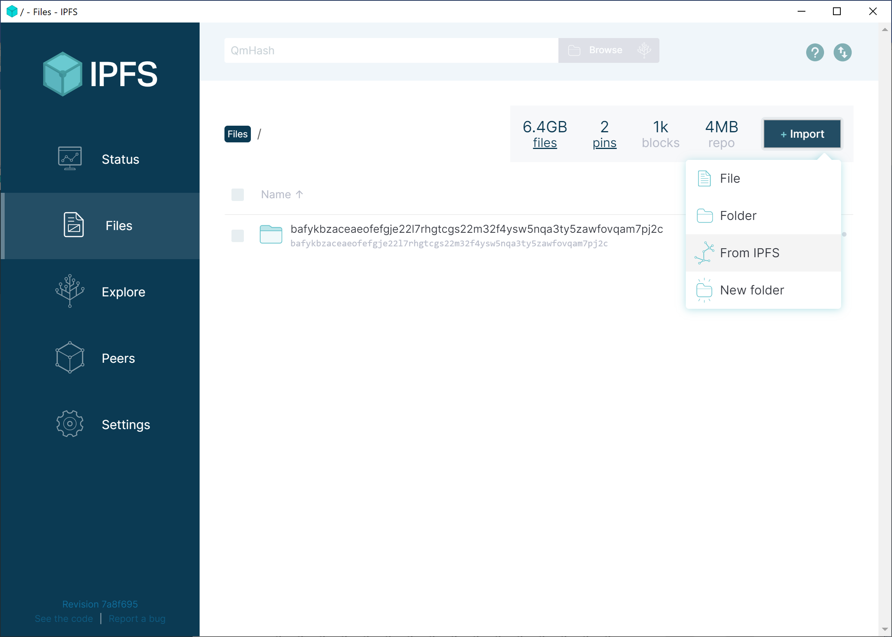

# IPFS Free Library

IPFS is here. IPFS is a de-centralized file and webhosting protocol founded on ideals of freedom and openness. The Library Genesis collection is live on IPFS as of today, accessible via [libgen.rs](http://libgen.rs) and [libgen.fun](https://libgen.fun). IPFS is like BitTorrent but has a single global swarm, and it's accessible on the web. You can learn about the IPFS project from [IPFS.io](https://ipfs.io) or [Wikipedia](https://en.wikipedia.org/wiki/InterPlanetary_File_System).

IPFS is the next technical revolution in peer-to-peer networking, allowing people like you to share books with readers who request them. IPFS is the next best weapon in the fight against domain take-downs and internet censorship.

We can now each become a founding shelf for a free, global library. Let's start.

## Get started

IPFS is simple. *Hosts* (you) *Pin* files (books) using *Content Identifiers* (CID Hashes) to share them on the IPFS network. CID Hashes can represent individual files or an entire folder. Pinning saves the files to your local computer so you can share them, and others can Pin them from you.

Each CID Hash for Library Genesis represents 1,000 books, or about 5 gigabytes of local file storage. 100 pins = 100,000 books! Who ever told you that you couldn't start your own library?

## Copyright warning

Before you begin, make sure you understand [the legal implications of hosting and sharing copyrighted material.](https://www.nolo.com/legal-encyclopedia/what-to-do-if-your-named-bit-torrent-lawsuit.html)

## Installing IPFS

Are you a power-user or run a server? Jump to the section on [getting started with Docker.](#docker-for-servers)

If you're not, just install the [IPFS Desktop client](https://ipfs.io/#install). Make sure to read the [desktop system requirements.](#system-requirements)

##Desktop client

###System requirements

Note that IPFS Desktop client is an alpha-stage software still in development. The command line version of the software for servers/home servers is more mature.

* Requires internet serice provider with unlimited bandwidth
* Do not share if you have a monthly bandwidth or data cap
* Recommended at least a toaster with 2GB RAM
* Recommended at least 100 mbps
* Recommended [port forwarding](#port-forwarding)

###Get started

####Pin your first CID Hash

Click Files > Import > From IPFS

Then copy and paste in your first CID Hash containing 1,000 books (about 6GB). Once it's complete, jump to the [CID Hash index](#cid-hash-index).

```
 
bafykbzaceaeofefgje22l7rhgtcgs22m32f4ysw5nqa3ty5zawfovqam7pj2c
 
```



## Docker for servers

Previously downloaded the Library Genesis torrents for the Library Genesis Seeding Project? Follow these steps then jump to [torrents](#torrents).

###System requirements

* Docker ([docker.com/get-docker](https://docs.docker.com/get-docker/))
* Requires internet serice provider with unlimited bandwidth. Do not install IPFS if you have a monthly bandwidth or data cap.
* Requires between 10GB or more of hard-drive space. For more information refer to the [CID Hash index with file sizes.](https://cryptpad.fr/sheet/#/2/sheet/view/I5UinPRnv2LNZlMQcNODieaoo7W9L1KDbJMX36OKvdE/)
* Recommended at least 16GB RAM and Intel i5 or equivalent processor
* Recommended at least 100 mbps, gigabit connection preferred
* Recommended [port forwarding](#port-forwarding)

### Get started

#### Create your docker container

You can more documentation for the Go-based IPFS Docker container at [Docker Hub.](https://hub.docker.com/r/ipfs/go-ipfs/).

/export will store your downloaded files, while the books from pinned CID Hashes will be located in /ipfs/data/blocks.

```
docker run -d \
--name go-ipfs \
-v $HOME/ipfs/export:/export \
-v $HOME/ipfs/data:/data/ipfs \
-p 4001:4001 \
-p 127.0.0.1:8080:8080 \
-p 127.0.0.1:5001:5001 \
ipfs/go-ipfs:latest 
```

```
docker start go-ipfs
```

#### Pin your first CID Hash

This 'docker exec' command runs your 'go-ipfs' container with container command 'ipfs pin add'. This CID Hash contains 1,000 books, to add it run:

```
docker exec go-ipfs ipfs pin add bafykbzaceaeofefgje22l7rhgtcgs22m32f4ysw5nqa3ty5zawfovqam7pj2c --progress
```

Once it's complete, jump to the [CID Hash index](#cid-hash-index).

You can also access the WebUI and add or manage pins from there. Port 5001 is the API port of the IPFS docker container and contains the same UI as IPFS desktop. You can access the webui in your browser at [http://127.0.0.1:5001/webui](http://127.0.0.1:5001/webui).


#### CID Hash index

Once you've pinned your first 1,000 you can add the next 2.7 million books of the Library Genesis Scitech collection.

The CID Hash Index is a comma-separated list containing the scitech directory number, filesize, and CID:

<iframe src="https://pastebin.com/embed_iframe/tPvE36Sd" style="border:none;width:100%"></iframe>

#### Port forwarding

The IPFS swarm peer port is 4001. Opening it up will help you connect, but it is optional if you can't do so. To learn how to port forward port 4001 search your [*router model + port forward.*](https://www.google.com/search?q=ac1750+port+forwarding)

##Torrents

Many volunteers have helped seed the torrents with the [Library Genesis Seeding Project](https://www.reddit.com/r/DataHoarder/comments/ed9byj/library_genesis_project_update_25_million_books/).

If you already downloaded the torrents you can add torrent folders to IPFS using `ipfs add`

Start go-ipfs normally with `docker start go-ipfs`

Configure go-ipfs to allow you link folders to the Filestore:

```
docker exec go-ipfs ipfs config --json Experimental.FilestoreEnabled true
```

Restart with `docker stop go-ipfs && docker start go-ipfs`

Add the folders from where you saved them, starting with folder 1000:

```
docker exec go-ipfs ipfs add $home/books/1000/ -r -w --nocopy --hash=blake2b-256 >>  $home/books/ipfs-add.log
```

Watch the log and check out the network activity:

```
docker exec go-ipfs tail -f $home/books/ipfs-add.log
docker exec go-ipfs ipfs stats bw --poll=true --interval=1s
```
